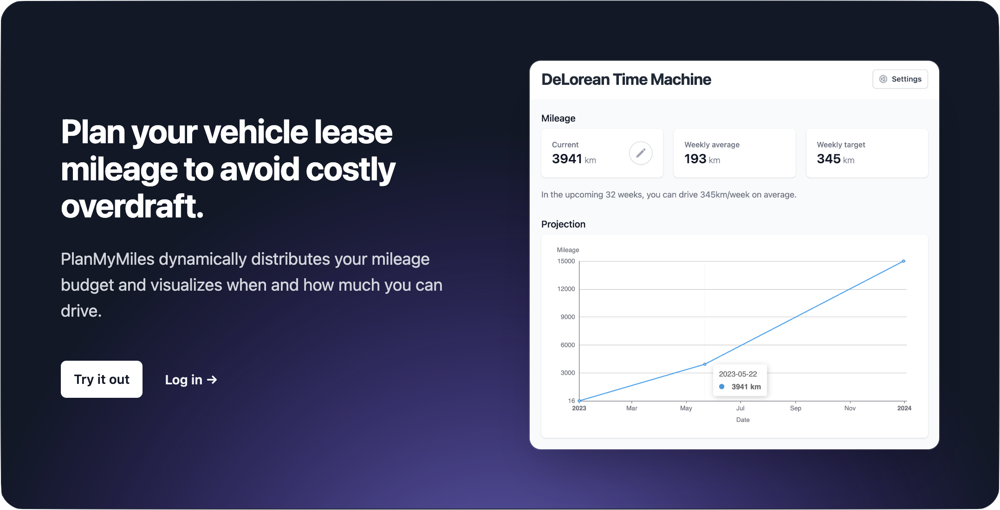

<h1>PlanMyMiles</h1>
<!-- TABLE OF CONTENTS -->
<details>
  <summary><b>Table of Contents</b></summary>
  <ol>
    <li>
      <a href="#about-the-project">About The Project</a>
      <ul>
        <li><a href="#built-with">Built With</a></li>
        <li><a href="#usage">Usage</a></li>
      </ul>
    </li>
    <li><a href="#roadmap">Roadmap</a></li>
    <li>
      <a href="#developing-locally">Developing locally</a>
      <ul>
        <li><a href="#prerequisites">Prerequisites</a></li>
        <li><a href="#firebase-setup">Firebase setup</a></li>
        <li><a href="#local-project-setup">Local project setup</a></li>
        <li><a href="#firebase-emulation-and-starting-the-app">Firebase Emulation and starting the app</a></li>
      </ul>
    </li>
    <li><a href="#license">License</a></li>
    <li><a href="#contact">Contact</a></li>
  </ol>
</details>

<!-- ABOUT THE PROJECT -->

## About The Project

PlanMyMiles is a web app that distributes your vehicle lease or insurance mileage budget dynamically and it lets you know if you have to change anything about your driving habits so that you can avoid costly overdraft.
<br />

### Built with:

[](#)
[](#)
[](#)
[](#)
[](#)
[](#)
[](#)
[](#)

<br />

[](https://planmymiles.web.app/)

<!-- USAGE EXAMPLES -->

### Usage

At the current state of development, new users are initialized with some sample data (in future releases, users will be onboarded interactively). Head over to `Settings` to set up your vehicle and then return to the `Dashboard` to enter your current mileage.

<br />
<!-- ROADMAP -->

[i5]: https://github.com/dhegedues/plan-my-miles/issues/5
[i9]: https://github.com/dhegedues/plan-my-miles/issues/9
[i10]: https://github.com/dhegedues/plan-my-miles/issues/10
[i11]: https://github.com/dhegedues/plan-my-miles/issues/11
[i13]: https://github.com/dhegedues/plan-my-miles/issues/13
## Roadmap

- [x] Base app
  - [x] Firebase Integration (Authentication, Database with real-time updates)
  - [x] Guest Users
  - [x] Registered Users
  - [x] Dashboard with widgets and a chart displaying a basic mileage projection
  - [x] Settings
- [ ] Enhancements
  - [ ] user onboarding on first time use ([#9][i9])
  - [ ] create a registered user from a guest user session ([#10][i10])
  - [ ] more precise error reporting towards users (e.g. regarding auth and invalid inputs, see [#5][i5] and [#11][i11])
  - [ ] 404 page ([#13][i13])
- [ ] Trips
  - [ ] plan trips and see how they affect the mileage projection
  - [ ] see how you can use your remaining mileage budget based on the comparison of everyday usage vs. trip usage
- [ ] Progressive Web App functionality
- [ ] Overdraft limit and costs
- [ ] Multiple vehicles


See the [open issues](https://github.com/dhegedues/plan-my-miles/issues) for a full list of proposed features and known issues.

<br />
<!-- GETTING STARTED -->

## Developing locally

If you want to try PlanMyMiles locally, these are the steps you have to follow.

### Prerequisites

- Install Node.js and npm

### Firebase setup

1. Create a project in the [Firebase Console](https://console.firebase.google.com)
2. Add Firebase to your web app
   1. Register your app
      1. Choose an app nickname
      2. Activate Firebase Hosting

   2. Save the shown `firebaseConfig` somewhere, you will need it in a minute

3. Setup Firebase CLI

   1. Install `firebase-tools` globally

      > I suggest using this specific version to prevent issues with wrong `esbuild` packages for ARM Macs

      ```
      npm install -g firebase-tools@12.0.1
      ```

   2. Log in with your Firebase account
      ```
      firebase login
      ```
   3. Enable web frameworks functionality for React
      ```
      firebase experiments:enable webframeworks
      ```

### Local project setup

1. Clone the project repository and `cd` into it

   ```
   git clone https://github.com/dhegedues/plan-my-miles.git && cd plan-my-miles
   ```

2. With the contents of your `firebaseConfig` that you put aside earlier, create a file called `.env.local` in the root of the project directory, as follows. Put the values directly behind the `=`.

    <pre style="line-height: 3rem">
      VITE_FIREBASE_API_KEY=<b style="background-color: black; color: white; padding: 0.4em; margin-left: 3px; border-radius: 5px; ">apiKey</b>
      VITE_FIREBASE_AUTH_DOMAIN=<b style="background-color: black; color: white; padding: 0.4em; margin-left: 3px; border-radius: 5px; ">authDomain</b>
      VITE_FIREBASE_PROJECT_ID=<b style="background-color: black; color: white; padding: 0.4em; margin-left: 3px; border-radius: 5px; ">projectId</b>
      VITE_FIREBASE_STORAGE_BUCKET=<b style="background-color: black; color: white; padding: 0.4em; margin-left: 3px; border-radius: 5px; ">storageBucket</b>
      VITE_FIREBASE_MESSAGING_SENDER_ID=<b style="background-color: black; color: white; padding: 0.4em; margin-left: 3px; border-radius: 5px; ">messagingSenderId</b>
      VITE_FIREBASE_APP_ID=<b style="background-color: black; color: white; padding: 0.4em; margin-left: 3px; border-radius: 5px; ">appId</b></pre>

3. Modify `.firebaserc` to include your `projectId` instead of plan-my-miles.

4. Install the dependencies
    ```
    npm install
    ```

### Firebase emulation and starting the app

1. Start the emulators
   ```
   firebase emulators:start
   ```

2. Ready!
   You should now be able to access the app at
   ```
   http://localhost:5000
   ```
   Hit `Try it out` to create a guest user account or sign up on the `Login` page!

3. Visit the emulator suite at
   ```
   http://localhost:4000
   ```
   to see the users that you created (Tab `Authentication`) and their data in the Firestore (Tab `Firestore`).
   <br />
   <br />

<!-- LICENSE -->

## License

Distributed under the MIT License. See [License](./LICENSE.md) for more information.

<br />
<!-- CONTACT -->

## Contact

Feel free to say <hello@dh.software> if you have any questions or suggestions!
